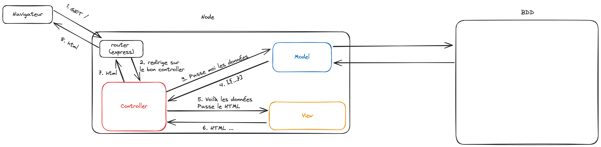
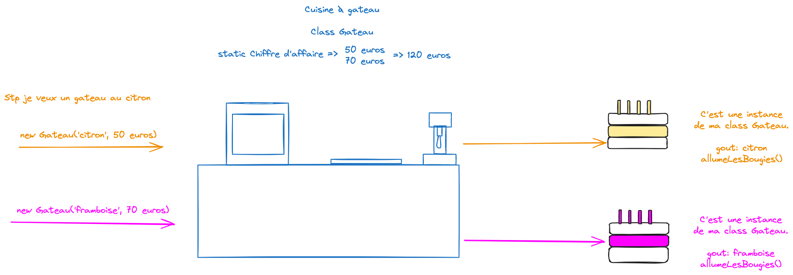

# S05E03 - Modèles et Active Record

## Menu du jour

```md
- Correction challenge
  - tous les modèles
  - et le CoreModel

- Architecture MVC
  - Data Access Layer
    - `DataMapper` (Design Pattern)
    - `Active Record` (Design Pattern)

- Page d'administration des Niveaux ?
```

## MVC



## Héritage



