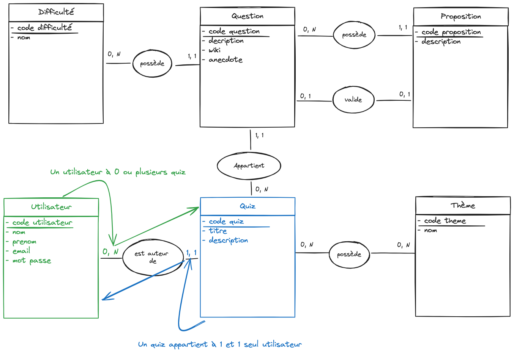

# MCD = Modèle Conceptuel de données

## But

Qu'est ce qui est stocké dans notre application et comment les données sont liées entre elles.

## Les étapes

### 1. Définir les entités et les attributs

Attention, dans un MCD, on ne met pas les données servant à faire nos relations (clé étrangère en BDD).

- Utilisateur : nom, prénom, email, mot de passe, (rôle sera ajouter plus tard)
- Quiz : titre, description
- Question : description, wiki, anecdote
- Proposition: description
- Theme : nom
- Difficulté : nom

### 2. Schématiser les entités et les attributs

On utilise un outil de dessin pour faire le schema (excalidraw, diagram.net, etc...)

### 3. Association

On ajoute les associations entre les entités.

On précise les cardinalités (0, 1, n)
